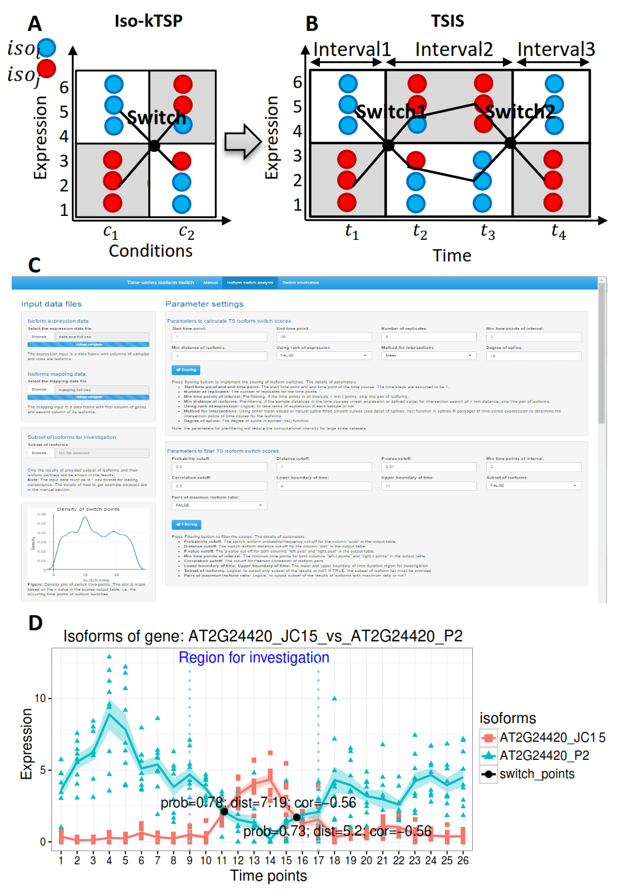
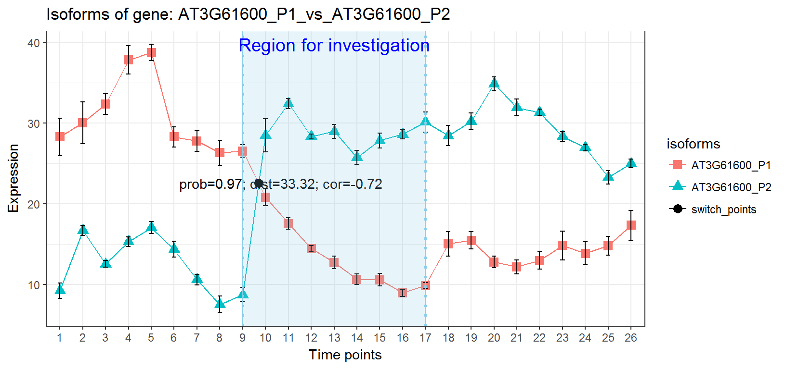
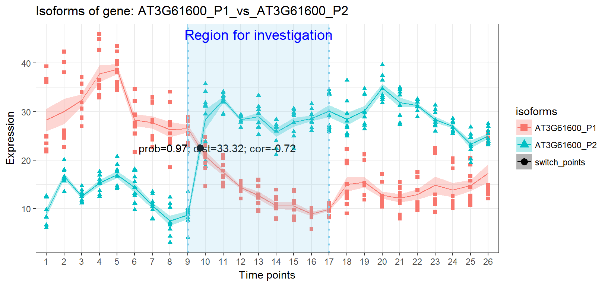

# Description
## Introduction
Transcript isoform, here referred as isoform, switch is an event that a pair of isoforms reverse the order of relative expression abundance in response to external and internal stimuli. Here, we provide a [TSIS](https://github.com/wyguo/TSIS) R package, which is the first tool for detecting isoform switch for time-series data. The TSIS method is an extension of [iso-kTSP](https://bitbucket.org/regulatorygenomicsupf/iso-ktsp) 
method for two condition comparisons [(Sebestyen, et al., 2015)](http://biorxiv.org/content/early/2014/07/04/006908) (see <a href="#fig1">Figure 1(A)</a>). 
The main steps of TSIS are to search for the isoform switch points in the time frame, score the quality of the switches and filter the results with user input parameters. All the functions are integrated into a Shiny App, in which users can implement the analysis as easy as mouse click. 

## Method

The steps of scoring the isoform switches:

### Step 1: search the intersctions.

<h2 id="step1"> </h2>

In theory, the expression for a pair of hypothetical isoforms $iso_i$ and $iso_j$ may experience a number isoform switch in the time-series. To search for these switch points where the order of abundances of two isoforms reverse relative expression profiles (see <a href="#fig1">Figure 1(B)</a>), two methods for intersections have been included in TSIS and users can choose which one to include 

- Method 1 uses average expression values of each isoform across all time points. For this, it is first taken the average values of the replicates for each time points in the input isoform expression data. Then the switches are determined by the intersections of the average time-series.

- Method 2 uses natural spline curves to fit the time-series data and find intersection points of the fitted curves for each pair of isoforms. See details in TSIS::ts.spline and [splines](https://stat.ethz.ch/R-manual/R-devel/library/splines/html/ns.html) package.


### Step 2: score the isoform switches

We defined 5 parameters to score the quality of isoform switch. The first two are the probability/frequency of switch and the sum of average distance before and after switch, used as Score 1 and Score 2 in [iso-kTSP](https://bitbucket.org/regulatorygenomicsupf/iso-ktsp) method [(Sebestyen, et al., 2015)](http://biorxiv.org/content/early/2014/07/04/006908) (see <a href="#fig1">Figure 1(A)</a>). To investigate the switches of two isoforms $iso_i$ and $iso_j$ in two conditions $c_1$ and $c_2$, Score 1 is defined as
\[S_1(iso_i,iso_j|c_1,c_2)=|p(iso_1>iso2|c_1)+p(iso_1<iso_2|c_2)-1|,\]
where $p(iso_1>iso2|c_1)$ and $p(iso_1<iso_2|c_2)$ are the frequencies/probabilities that the samples of one isoform is greater or less than in the other in corresponding conditions. Score 2 is defined as
\[S_2(iso_i,iso_j|c_1,c_2)=|mean.dist(iso_i,iso_2|c_1)|+|mean.dist(ios_1,iso_2|c_2)|,\]
where $mean.dist(iso_i,iso_2|c_1)$ and $mean.dist(ios_1,iso_2|c_2)$ are the mean distances of samples in conditions $c_1$ and $c_2$, respectively.

To identify each switch, TSIS divides the time-series into time intervals by the intersection points determined in <a href="#step1">Step 1</a>. For example, in <a href="#fig1">Figure 1(B)</a>, four time points are divided into three intervals with the intersection points at switch1 and switch2. Essentially, TSIS has extended the iso-kTSP method by identifying the samples in each pair of consecutive intervals (i.e. before and after switch) and assimilating them as samples in two conditions to implement the calculation of Score 1 and Score 2.

The time-series isoform switches are more complex than the comparisons over two conditions. In addition to Score 1 and Score 2 for each switch point, we defined other 3 parameters as additional scores to evaluate the switches. 

- p-value of paired t-test for the two isoform sample differences within each interval. 
- Time points number within each interval. 
- Pearson correlation of two isoforms. For example, the correlation of $iso_i$ and $iso_j$ is 


### Step 3: filter the scores
A putative isoform switch should have:

-	high Score 1, suggesting higher frequency/probability of isoform switch.
-	large value of Score 2, indicating bigger expression distances between isoforms.
-	samples in the intervals before and after switch with significantly different expression values.
-	a switch event lasting for as many time points as possible in both intervals before and after switch, i.e. the intervals should contain a high number of time points.
-	optional filtering: users can investigate the co-expressed isoform pairs with high Pearson correlation. Note: the isoform pairs with high negative correlation may show more visually striking isoform switch patterns in expression graphs. 


Cut-offs can be applied the above scores to refine the isoform switch predictions. 

### Subset of results

Users may need to investigate subset of isoforms for specific purpose. Three options are built-in the TSIS package.

-	Users can set the lower and upper boundaries of a region in their time-series experiment to study the switches only within this region.
-	Users can provide a name list of isoforms so that TSIS generates results for those isoforms only.
-	Users can select to only output the results of isoforms with maximum proportion values to total gene expression.

#Installation and loading

##Install dependency packages

```{r,eval=F}
install.packages(c("shiny", "shinythemes","ggplot2","plotly","zoo","gtools","devtools"), dependencies=TRUE)

```

##Install TSIS package
Install [TSIS](https://github.com/wyguo/TSIS) package from Github using [devtools](https://cran.r-project.org/web/packages/devtools/index.html) package.
```{r,eval=F}
library(devtools)
devtools::install_github("wyguo/TSIS")
```

##Loading

Once installed, TSIS package can be loaded as normal
```{r,eval=T}
library(TSIS)
```

##Installation Error

There is a big issue to use [devtools](https://cran.r-project.org/web/packages/devtools/index.html) to install R packages from [Github](https://github.com/) or [Bioconductor](https://www.bioconductor.org/). If the installed R software is located in a directory with space, for example in "C:\\Program Files", users may get error message "'C:\\Program' is not recognized as an internal or external command". It is because [devtools](https://cran.r-project.org/web/packages/devtools/index.html) cannot properly escape paths. This issue is not solved currently. The recommended solution is to remove and re-install R in a directory with no space. Users can check the software location by typing

```{r,eval=F}
R.home()
```

# Shiny App -- as easy as mouse click

To make the implement more user friendly, TSIS analysis is integrated into a [Shiny App](https://shiny.rstudio.com/) (a web application framework for R) (Chang, et al., 2016). By typing TSIS.app() in R console after loading TSIS package, the App is opened in the default web browser. Users can upload input datasets, set parameters for switch analysis, visualize and save the results as easy as mouse click. The Shiny App includes three tab panels (see <a href="#fig1">Figure 1(C)</a>).

## Tab panel 1: Manual

The first tab panel includes this user manual.

## Tab panel 2: Isoform switch analysis

There are five sections in this panel.

### Input data files
Three types of information are required for TSIS analysis.

- Information 1: Time-series isoform expression data with $T$ time points and $R$ replicates, with each row represents an isoform and each column represents a sample. 
- Information 2: Gene and isoform mapping table corresponding to Dataset 1, with first column of gene names and second column of isoform names.
- Information 3: Optional. Names of subset of isoforms. Users can output subset of results by providing a list of isoforms, for example the protein coding transcripts. 

The [TSIS](https://github.com/wyguo/TSIS) package provides the example datasets "AtRTD2" with 300 genes and 766 isoforms, analysed in 26 time points, each with 3 biological replicates and 3 technical replicates. The experiments were designed to investigate the Arabidopsis gene expression response to cold. The isoform expression is in TPM (transcript per million) format. 
For the experiments and data quantification details, please see the AtRTD2 paper [(Zhang, et al.,2016)](http://biorxiv.org/content/early/2016/05/06/051938). Typing the following command to see data information.

```{r,eval=F}
##26 time points, 3 biological replicates and 3 technical replicates, in total 234 sample points. 
library(TSIS)
AtRTD2$data.exp[1:10,1:3]
AtRTD2$mapping[1:10,]
AtRTD2$sub.isoforms[1:10]
```

Note: The data loaded into the Shiny App must be in *.csv format for loading convenience. Users can download the [example datasets](https://github.com/wyguo/TSIS/examples) from https://github.com/wyguo/TSIS/tree/master/examples or by typing the following codes:

```{r,echo=T,eval=F}
AtRTD2.example(dir='data')
```
where "dir" is the folder to save the data in the working directory. If it does not exist, a new folder will be created with the name. 

### Parameter settings

This section is used to set the parameters for TSIS scoring and filtering. The main dependency functions are [TSIS::iso.switch](https://github.com/wyguo/TSIS/tree/master/R) and [TSIS::score.filter](https://github.com/wyguo/TSIS/tree/master/R). Please go to the isoform switch analysis panel or the help documentation for details.

### Density of switch points
The density plot of switch time for all pair of isoforms. 

### Input datasets visualization

The data table of input information.

### Output scores for isoform switch

The TSIS score table. The columns include the information of isoform names, isoform ratios to genes, the intervals before and after switch, the coordinates of switch points and five scores of switch quality. 

## Tab panel 3: Switch visualization

### Switch plots
This section is used to make a time-series plot of a pair of isoforms by providing their names. Plot type options are error bar plot and ribbon plot (see functions geom_errorbar and geom_smooth in [ggplot2](http://ggplot2.org) package for details). The plots can be saved in html ([plotly](https://plot.ly/) format plot), png or pdf format (see examples in <a href="#fig1">Figure 1(D)</a>, <a href="#error_bar">Error bar plot </a> and <a href="#ribbon">Ribbon plot </a>).

### Multiple plots for switch
This section is used to save top $n$ (ranking with Score 1 probability/frequency of switch) pairs of isoforms into png or pdf format plots. 

<h2 id="fig1"> </h2>

**Figure 1: Isoform switch analysis methods.** Expression data with 3 replicates for each condition/time point is simulated for isoforms $iso_i$ and $iso_j$. (A) is the iso-kTSP algorithm for comparisons of two conditions $c_1$ and $c_2$. The iso-kTSP is extended to time-series isoform switch (TSIS) in figure (B). The time-series with 4 time points is divided into 3 intervals with breaks of isoform switch points, which are the intersections of average expression of 3 replicates. Consecutive intervals are assimilated as the conditions in iso-kTPS. Thereby, the scores for each switch point can been determined based on the intervals before and after the switch occurs. Additionally, 3 extra parameters are defined to further refine the isoform switch results, the p-value of paired t-test for sample differences, the time point number in each interval and the Pearson correlation of two isoforms. (C) is the “isoform switch analysis” tab panel of the TSIS Shiny App. (D) is an example of isoform switch ribbon plot produced by the App.

# TSIS scripts -- step by step analysis

In addition to the Shiny App, users can use scripts to do TSIS analysis in R console. The following examples show a step-by-step tutorial of the analysis. Please refer to the function details using help function, e.g. help(iso.switch) or ?iso.switch.

## Loading datasets

```{r,echo=T,eval=T}
##load the data
data.exp<-AtRTD2$data.exp
mapping<-AtRTD2$mapping
dim(data.exp);dim(mapping)
```

##Scoring
**Example 1: search intersection points with mean expression**

```{r}
##Scores
scores.mean2int<-iso.switch(data.exp=data.exp,mapping =mapping,
                     t.start=1,t.end=26,nrep=9,rank=F,
                     min.t.points =2,min.distance=1,spline =F,spline.df = 9,verbose = F)
```

**Example 2: search intersection points with spline method**
```{r}
##Scores
scores.spline2int<-suppressMessages(iso.switch(data.exp=data.exp,mapping =mapping,
                     t.start=1,t.end=26,nrep=9,rank=F,
                     min.t.points =2,min.distance=1,spline =T,spline.df = 9,verbose = F))
```

## Filtering

**Example 1, general filtering with provided cut-offs**

```{r}
##intersection from mean expression
scores.mean2int.filtered<-score.filter(scores = scores.mean2int,prob.cutoff = 0.5,dist.cutoff = 1,
                                       t.points.cutoff = 2,pval.cutoff = 0.01, cor.cutoff = 0.5,
                                       data.exp = NULL,mapping = NULL,sub.isoform.list = NULL,
                                       sub.isoform = F,max.ratio = F,x.value.limit = c(9,17) )

scores.mean2int.filtered[1:5,]


```

```{r,eval=F}

##intersection from spline method
scores.spline2int.filtered<-score.filter(scores = scores.spline2int,prob.cutoff = 0.5,
                                         dist.cutoff = 1,t.points.cutoff = 2,pval.cutoff = 0.01,
                                         cor.cutoff = 0.5,data.exp = NULL,mapping = NULL,
                                         sub.isoform.list = NULL,sub.isoform = F,max.ratio = F,
                                         x.value.limit = c(9,17) )
  
```


<br>
**Example 2, only show subset of results according to a isoform list**

```{r,eval=F}
##intersection from mean expression
sub.isoform.list<-AtRTD2$sub.isoforms
sub.isoform.list[1:10]
scores.mean2int.filtered.subset<-score.filter(scores = scores.mean2int,prob.cutoff = 0.5,dist.cutoff = 1,
                                       t.points.cutoff = 2,pval.cutoff = 0.01, cor.cutoff = 0.5,
                                       data.exp = NULL,mapping = NULL,sub.isoform.list = sub.isoform.list,
                                       sub.isoform = T,max.ratio = F,x.value.limit = c(9,17) )

```

<br>
**Example 3, only show results of isoforms of maximum ratios to genes**

```{r,eval=F}
scores.mean2int.filtered.maxratio<-score.filter(scores = scores.mean2int,prob.cutoff = 0.5,dist.cutoff = 1,
                                       t.points.cutoff = 2,pval.cutoff = 0.01, cor.cutoff = 0,
                                       data.exp = data.exp,mapping = mapping,sub.isoform.list = NULL,
                                       sub.isoform = F,max.ratio = T,x.value.limit = c(9,17) )
```
                                       
## Make plots

###Error bar plot
```{r,eval=F,fig.width=8.5,fig.height=4}
plotTSIS(data2plot = data.exp,scores = scores.mean2int.filtered,iso1 = 'AT3G61600_P1',
        iso2 = 'AT3G61600_P2',gene.name = NULL,y.lab = 'Expression',make.plotly = F,
        t.start = 1,t.end = 26,nrep = 9,prob.cutoff = 0.5,x.lower.boundary = 9,
        x.upper.boundary = 17,show.region = T,show.scores = T,
        line.width =0.5,point.size = 3,error.type = 'stderr',show.errorbar = T,errorbar.size = 0.5,
        errorbar.width = 0.2,spline = F,spline.df = NULL,ribbon.plot = F )

```

<h2 id="error_bar"> </h2>

###Ribbon plot
```{r,eval=F,fig.width=8.5,fig.height=4}
plotTSIS(data2plot = data.exp,scores = scores.mean2int.filtered,iso1 = 'AT3G61600_P1',
        iso2 = 'AT3G61600_P2',gene.name = NULL,y.lab = 'Expression',make.plotly = F,
        t.start = 1,t.end = 26,nrep = 9,prob.cutoff = 0.5,x.lower.boundary = 9,
        x.upper.boundary = 17,show.region = T,show.scores = T,error.type = 'stderr',
        line.width =0.5,point.size = 3,show.errorbar = T,errorbar.size = 0.5,
        errorbar.width = 0.2,spline = F,spline.df = NULL,ribbon.plot = T )

```
                                       
<h2 id="ribbon"> </h2>

#References
Chang, W., et al. 2016. shiny: Web Application Framework for R. https://CRAN.R-project.org/package=shiny

Sebestyen, E., Zawisza, M. and Eyras, E. Detection of recurrent alternative splicing switches in tumor samples reveals novel signatures of cancer. Nucleic Acids Res 2015;43(3):1345-1356.

Zhang, R., et al. AtRTD2: A Reference Transcript Dataset for accurate quantification of alternative splicing and expression changes in Arabidopsis thaliana RNA-seq data. bioRxiv 2016.


#Session Info

```{r session, echo=FALSE}
sessionInfo()
```
